

   

<h1 align="center">
Codigrate Themes for MacOS Terminal
</h1>

A carefully crafted collection of MacOS Terminal themes inspired by nature and iconic cities around the world.
Each theme is designed with balance, readability, and long terminal sessions in mind—blending distinctive atmospheres
with thoughtfully tuned colors that make your terminal feel both elegant and comfortable.
Whether you prefer calm, light environments or deep, immersive dark palettes,
these themes aim to make your command line experience visually inspiring and pleasantly focused.

## Getting Started

1. Open the **Terminal** app on your Mac.
2. Download the **.terminal** profile you want to use.
3. Double-click the file to import it into Terminal (or open **Terminal → Settings → Profiles → the ⋯ menu → Import…** and choose the file).
4. Select the imported profile and click **Default** to make it your default.
5. Open a new Terminal window to apply the theme.

## Notes

- These themes are designed for the built-in **macOS Terminal** (Terminal.app).
- Theme appearance may vary slightly depending on your macOS version, font rendering, and window transparency/opacity settings.
- For the most consistent look, use the recommended background and accent colors provided in each palette.

## Nature

   <a href="https://codigrate.com/theme?product=everest&category=nature">
      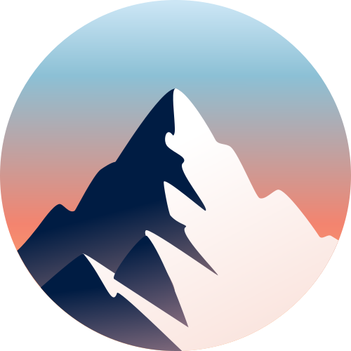
   </a>

<h1 align="center">
   Everest
</h1>

## Description

Inspired by the icy terraces of Mount Everest and the first light breaking over its peaks, this theme pairs cool white and pale grey backgrounds with deep glacier blues and greens to create a clear and unhurried coding environment. Bright, airy surfaces keep the editor calm, while teals, forest greens, and a warm coral accent add definition and focus to key syntax elements.

## Screenshots

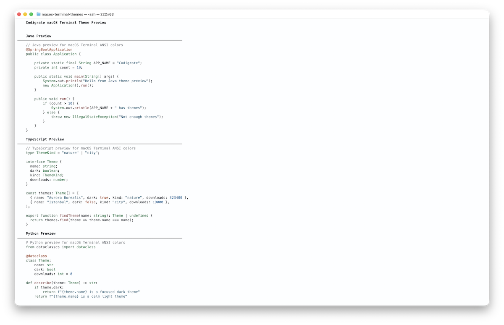

## Color Palette

<table>
   <tr>
      <td></td>
      <td>
         Summit Snow
      </td>
      <td>
         Background
      </td>
      <td>
         <a href="https://codigrate.com/tools/color/FDFEFF">#FDFEFF</a>
      </td>
   </tr>
   <tr>
      <td></td>
      <td>
         Midnight Ridge
      </td>
      <td>
         Foreground
      </td>
      <td>
         <a href="https://codigrate.com/tools/color/131B25">#131B25</a>
      </td>
   </tr>
   <tr>
      <td></td>
      <td>
         Morning Mist
      </td>
      <td>
         Selection Background
      </td>
      <td>
         <a href="https://codigrate.com/tools/color/D5ECE2">#D5ECE2</a>
      </td>
   </tr>
   <tr>
      <td></td>
      <td>
         Storm Grey
      </td>
      <td>
         Cursor
      </td>
      <td>
         <a href="https://codigrate.com/tools/color/467196">#467196</a>
      </td>
   </tr>
</table>

---

   <a href="https://codigrate.com/theme?product=aurora-borealis&category=nature">
      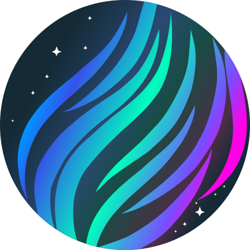
   </a>

<h1 align="center">
   Aurora Borealis
</h1>

## Description

Inspired by the Arctic night sky and the slow drift of the Northern Lights, this theme blends deep navy and teal shadows with luminous blue and green accents to create a calm yet vivid coding environment. Dark, cool backgrounds keep the editor restful, while bright cyans, fresh greens, and soft lavenders add clarity and energy to key syntax elements.

## Screenshots

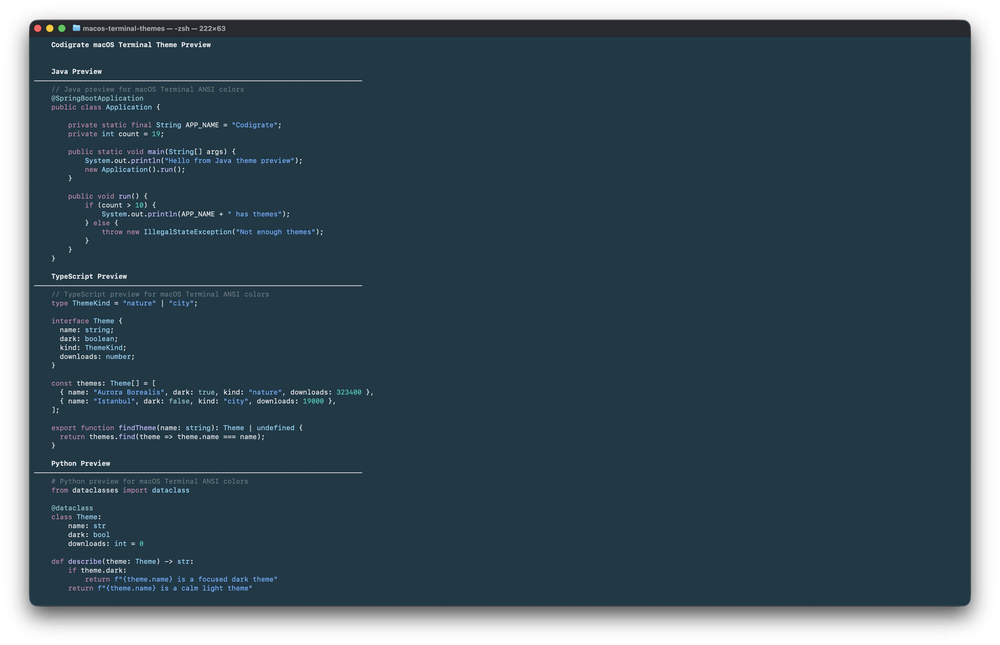

## Color Palette

<table>
   <tr>
      <td></td>
      <td>
         Polar Night
      </td>
      <td>
         Background
      </td>
      <td>
         <a href="https://codigrate.com/tools/color/142B37">#142B37</a>
      </td>
   </tr>
   <tr>
      <td></td>
      <td>
         Moonlit Frost
      </td>
      <td>
         Foreground
      </td>
      <td>
         <a href="https://codigrate.com/tools/color/E0E2E3">#E0E2E3</a>
      </td>
   </tr>
   <tr>
      <td></td>
      <td>
         Deep Fjord
      </td>
      <td>
         Selection Background
      </td>
      <td>
         <a href="https://codigrate.com/tools/color/643C59">#643C59</a>
      </td>
   </tr>
   <tr>
      <td></td>
      <td>
         Arctic Cyan
      </td>
      <td>
         Cursor
      </td>
      <td>
         <a href="https://codigrate.com/tools/color/8DC5E1">#8DC5E1</a>
      </td>
   </tr>
</table>

---

   

<h1 align="center">
   Sakura
</h1>

## Description

Inspired by cherry blossom season and the quiet gardens beneath it, this theme pairs pale petal backgrounds with deep rose and plum accents to create a soft and unhurried coding environment. Light, gentle surfaces keep the editor calm, while muted greens and clear sky blues add balance and focus to key syntax elements.

## Screenshots

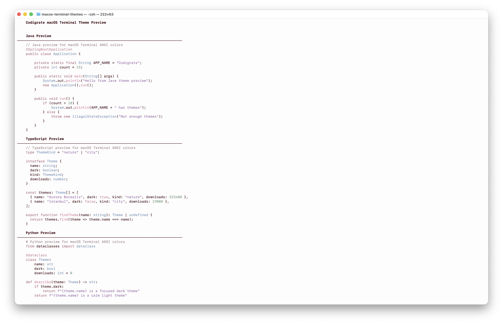

## Color Palette

<table>
   <tr>
      <td></td>
      <td>
         Blossom White
      </td>
      <td>
         Background
      </td>
      <td>
         <a href="https://codigrate.com/tools/color/FEFCFC">#FEFCFC</a>
      </td>
   </tr>
   <tr>
      <td></td>
      <td>
         Dark Cherry
      </td>
      <td>
         Foreground
      </td>
      <td>
         <a href="https://codigrate.com/tools/color/29000D">#29000D</a>
      </td>
   </tr>
   <tr>
      <td></td>
      <td>
         Wisteria Mist
      </td>
      <td>
         Selection Background
      </td>
      <td>
         <a href="https://codigrate.com/tools/color/E7CFDF">#E7CFDF</a>
      </td>
   </tr>
   <tr>
      <td></td>
      <td>
         Rose Garden
      </td>
      <td>
         Cursor
      </td>
      <td>
         <a href="https://codigrate.com/tools/color/C55EA5">#C55EA5</a>
      </td>
   </tr>
</table>

---

   

<h1 align="center">
   Sequoia
</h1>

## Description

Inspired by the towering stillness of a sequoia grove, this theme blends deep forest black and bark brown with living green and moss accents to create a grounded and focused coding environment. Dark, earthy backgrounds settle the editor, while warm tans, rusts, and a clear canopy green add contrast and clarity to key syntax elements.

## Screenshots

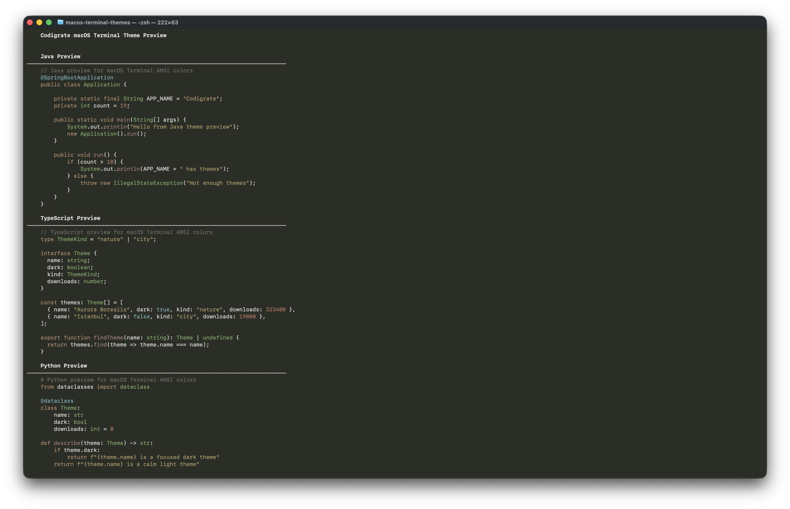

## Color Palette

<table>
   <tr>
      <td></td>
      <td>
         Forest Floor
      </td>
      <td>
         Background
      </td>
      <td>
         <a href="https://codigrate.com/tools/color/20231C">#20231C</a>
      </td>
   </tr>
   <tr>
      <td></td>
      <td>
         Morning Light
      </td>
      <td>
         Foreground
      </td>
      <td>
         <a href="https://codigrate.com/tools/color/D7D6D5">#D7D6D5</a>
      </td>
   </tr>
   <tr>
      <td></td>
      <td>
         Evergreen Shade
      </td>
      <td>
         Selection Background
      </td>
      <td>
         <a href="https://codigrate.com/tools/color/453A34">#453A34</a>
      </td>
   </tr>
   <tr>
      <td></td>
      <td>
         Jade Moss
      </td>
      <td>
         Cursor
      </td>
      <td>
         <a href="https://codigrate.com/tools/color/0B7E63">#0B7E63</a>
      </td>
   </tr>
</table>

---

   

<h1 align="center">
   Autumn
</h1>

## Description

Inspired by fallen leaves and late afternoon sunlight, this theme blends soft parchment backgrounds with rust, copper, and harvest gold to create a warm and unhurried coding environment. Light, gentle surfaces keep the editor comfortable, while deep greens and a quiet teal add contrast and focus to key syntax elements.

## Screenshots

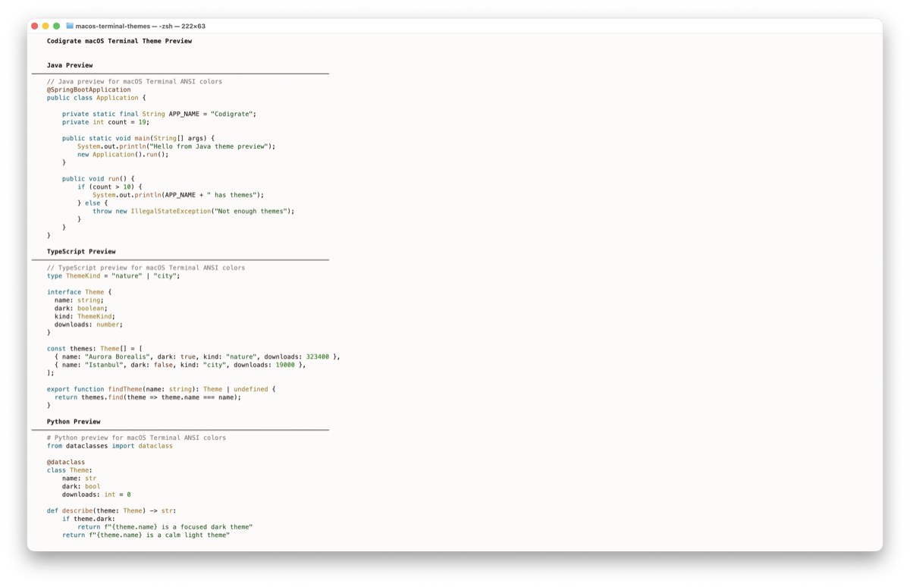

## Color Palette

<table>
   <tr>
      <td></td>
      <td>
         Parchment
      </td>
      <td>
         Background
      </td>
      <td>
         <a href="https://codigrate.com/tools/color/FCFBFA">#FCFBFA</a>
      </td>
   </tr>
   <tr>
      <td></td>
      <td>
         Dark Walnut
      </td>
      <td>
         Foreground
      </td>
      <td>
         <a href="https://codigrate.com/tools/color/251B13">#251B13</a>
      </td>
   </tr>
   <tr>
      <td></td>
      <td>
         Late Meadow
      </td>
      <td>
         Selection Background
      </td>
      <td>
         <a href="https://codigrate.com/tools/color/DFEFCB">#DFEFCB</a>
      </td>
   </tr>
   <tr>
      <td></td>
      <td>
         Harvest Gold
      </td>
      <td>
         Cursor
      </td>
      <td>
         <a href="https://codigrate.com/tools/color/6B9A24">#6B9A24</a>
      </td>
   </tr>
</table>

---

   <a href="https://codigrate.com/theme?product=roraima&category=nature">
      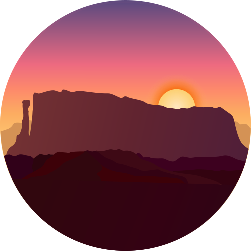
   </a>

<h1 align="center">
   Roraima
</h1>

## Description

Inspired by the sunset over Mount Roraima and the slow turn from day to night on its tabletop summit, this theme blends deep brown and clay shadows with amber, gold, and salmon accents to create a soothing yet vivid coding environment. Dark, earthy backgrounds ground the editor, while soft violets and mineral yellows add contrast and focus to key syntax elements.

## Screenshots

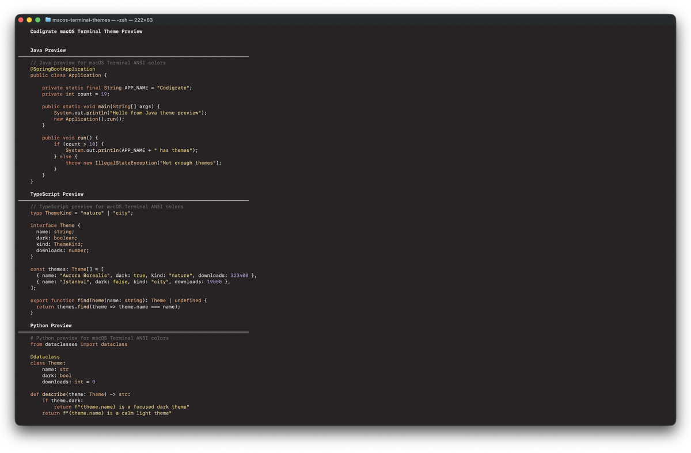

## Color Palette

<table>
   <tr>
      <td></td>
      <td>
         Tepui Night
      </td>
      <td>
         Background
      </td>
      <td>
         <a href="https://codigrate.com/tools/color/1E1A1B">#1E1A1B</a>
      </td>
   </tr>
   <tr>
      <td></td>
      <td>
         Cloud Veil
      </td>
      <td>
         Foreground
      </td>
      <td>
         <a href="https://codigrate.com/tools/color/D0CCCD">#D0CCCD</a>
      </td>
   </tr>
   <tr>
      <td></td>
      <td>
         Terracotta Shade
      </td>
      <td>
         Selection Background
      </td>
      <td>
         <a href="https://codigrate.com/tools/color/562F2F">#562F2F</a>
      </td>
   </tr>
   <tr>
      <td></td>
      <td>
         Coral Canyon
      </td>
      <td>
         Cursor
      </td>
      <td>
         <a href="https://codigrate.com/tools/color/DF6F50">#DF6F50</a>
      </td>
   </tr>
</table>

---

   <a href="https://codigrate.com/theme/content?product=salda&platform=macos%20terminal">
      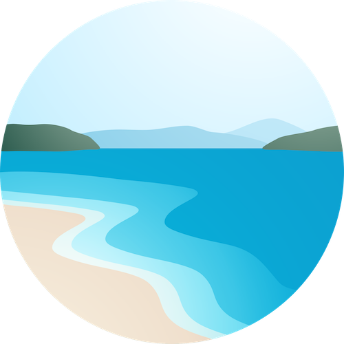
   </a>

<h1 align="center">
   Salda
    
   (Premium)
</h1>

## Description

Inspired by the white shores and turquoise shallows of Lake Salda, this theme pairs warm sand and soft cream backgrounds with clear lagoon blues and teals to create a bright and unhurried coding environment. Pale, airy surfaces keep the editor calm, while lagoon blues, shaded teals, and a fresh reed green add definition and focus to key syntax elements.

## Screenshots

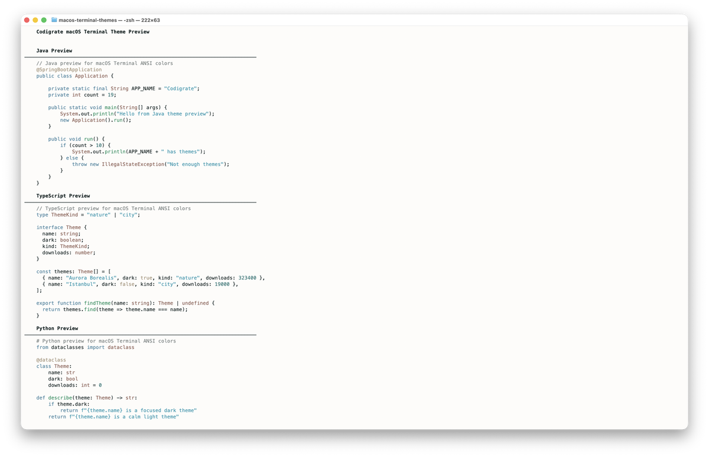

## Color Palette

<table>
   <tr>
      <td></td>
      <td>
         White Sand
      </td>
      <td>
         Background
      </td>
      <td>
         <a href="https://codigrate.com/tools/color/FDFCFA">#FDFCFA</a>
      </td>
   </tr>
   <tr>
      <td></td>
      <td>
         Dark Cedar
      </td>
      <td>
         Foreground
      </td>
      <td>
         <a href="https://codigrate.com/tools/color/102020">#102020</a>
      </td>
   </tr>
   <tr>
      <td></td>
      <td>
         Sandbank
      </td>
      <td>
         Selection Background
      </td>
      <td>
         <a href="https://codigrate.com/tools/color/EAD5BF">#EAD5BF</a>
      </td>
   </tr>
   <tr>
      <td></td>
      <td>
         Clay Bank
      </td>
      <td>
         Cursor
      </td>
      <td>
         <a href="https://codigrate.com/tools/color/8D7540">#8D7540</a>
      </td>
   </tr>
</table>

---

   <a href="https://codigrate.com/theme/content?product=ocean&platform=macos%20terminal">
      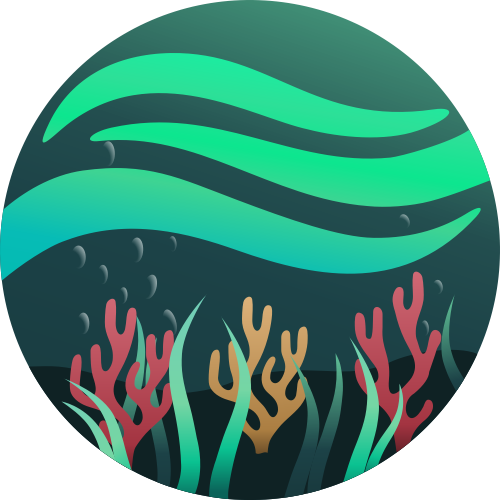
   </a>

<h1 align="center">
   Ocean
    
   (Premium)
</h1>

## Description

Inspired by the deep sea and the quiet glow of life far below the surface, this theme layers dark teal and blue-green shadows with bioluminescent cyan, coral pink, and sea glass accents to create a calm and immersive coding environment. Deep, cool backgrounds keep the editor restful, while bright cyans, soft pinks, and warm sandbar tones add clarity and focus to key syntax elements.

## Screenshots

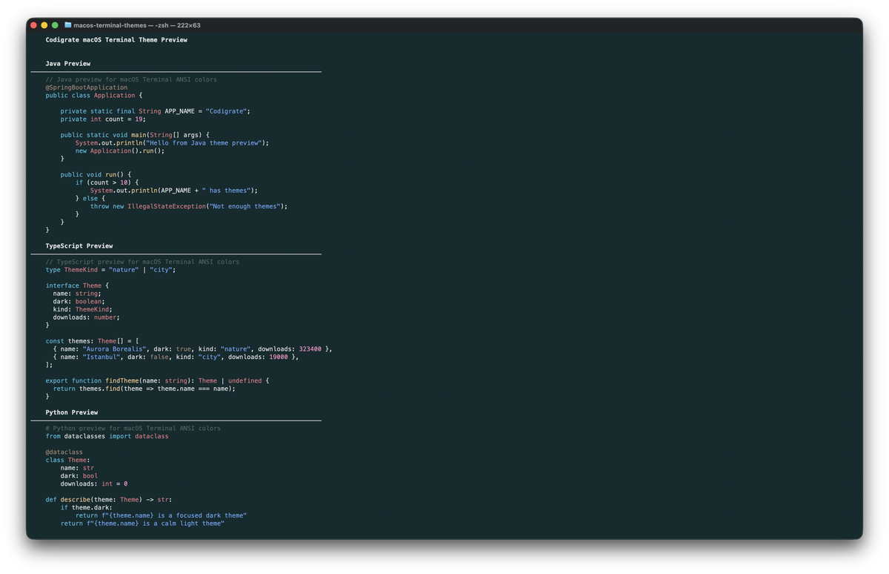

## Color Palette

<table>
   <tr>
      <td></td>
      <td>
         Deep Water
      </td>
      <td>
         Background
      </td>
      <td>
         <a href="https://codigrate.com/tools/color/102B2E">#102B2E</a>
      </td>
   </tr>
   <tr>
      <td></td>
      <td>
         Sea Salt
      </td>
      <td>
         Foreground
      </td>
      <td>
         <a href="https://codigrate.com/tools/color/D9DDDD">#D9DDDD</a>
      </td>
   </tr>
   <tr>
      <td></td>
      <td>
         Dark Current
      </td>
      <td>
         Selection Background
      </td>
      <td>
         <a href="https://codigrate.com/tools/color/3E3136">#3E3136</a>
      </td>
   </tr>
   <tr>
      <td></td>
      <td>
         Sea Salt
      </td>
      <td>
         Cursor
      </td>
      <td>
         <a href="https://codigrate.com/tools/color/8DE1DA">#8DE1DA</a>
      </td>
   </tr>
</table>

---

   <a href="https://codigrate.com/theme/content?product=reynisfjara&platform=macos%20terminal">
      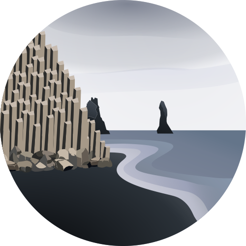
   </a>

<h1 align="center">
   Reynisfjara
    
   (Premium)
</h1>

## Description

Inspired by the black sand of Reynisfjara at dusk, where basalt columns rise over the wet shore and the last light fades on the North Atlantic, this theme layers charcoal and slate shadows with driftwood, pebble, and bleached sand accents to create a calm and cinematic coding environment. Deep, muted backgrounds keep the editor restful, while warm timbers, pale driftwoods, and soft sands add clarity and focus to key syntax elements.

## Screenshots

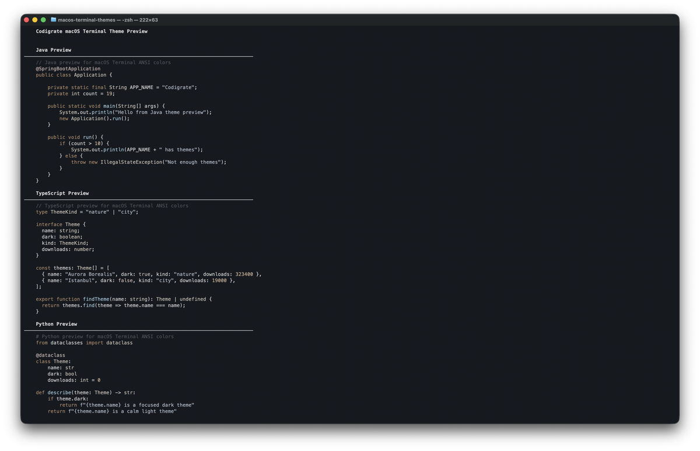

## Color Palette

<table>
   <tr>
      <td></td>
      <td>
         Black Sand
      </td>
      <td>
         Background
      </td>
      <td>
         <a href="https://codigrate.com/tools/color/151A20">#151A20</a>
      </td>
   </tr>
   <tr>
      <td></td>
      <td>
         Sea Spray
      </td>
      <td>
         Foreground
      </td>
      <td>
         <a href="https://codigrate.com/tools/color/CBCDCF">#CBCDCF</a>
      </td>
   </tr>
   <tr>
      <td></td>
      <td>
         Wet Sand
      </td>
      <td>
         Selection Background
      </td>
      <td>
         <a href="https://codigrate.com/tools/color/3E2E35">#3E2E35</a>
      </td>
   </tr>
   <tr>
      <td></td>
      <td>
         Sea Spray
      </td>
      <td>
         Cursor
      </td>
      <td>
         <a href="https://codigrate.com/tools/color/BDCADE">#BDCADE</a>
      </td>
   </tr>
</table>

---

   <a href="https://codigrate.com/theme/content?product=etna&platform=macos%20terminal">
      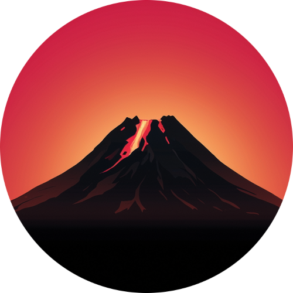
   </a>

<h1 align="center">
   Etna
    
   (Premium)
</h1>

## Description

Inspired by Mount Etna's nighttime eruptions, this dark theme builds on an ashen basalt grey base and layers in the incandescent reds, oranges, and golds of molten lava. The near-neutral charcoal surface keeps long sessions calm, while the warm lava accents draw the eye to what matters.

## Screenshots

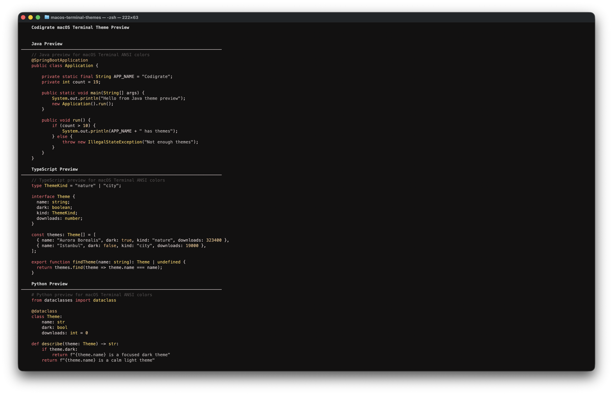

## Color Palette

<table>
   <tr>
      <td></td>
      <td>
         Volcanic Ash
      </td>
      <td>
         Background
      </td>
      <td>
         <a href="https://codigrate.com/tools/color/121111">#121111</a>
      </td>
   </tr>
   <tr>
      <td></td>
      <td>
         White Ash
      </td>
      <td>
         Foreground
      </td>
      <td>
         <a href="https://codigrate.com/tools/color/D3C6C6">#D3C6C6</a>
      </td>
   </tr>
   <tr>
      <td></td>
      <td>
         Slag Grey
      </td>
      <td>
         Selection Background
      </td>
      <td>
         <a href="https://codigrate.com/tools/color/343232">#343232</a>
      </td>
   </tr>
   <tr>
      <td></td>
      <td>
         Smoke Veil
      </td>
      <td>
         Cursor
      </td>
      <td>
         <a href="https://codigrate.com/tools/color/CEA1A4">#CEA1A4</a>
      </td>
   </tr>
</table>

---

   <a href="https://codigrate.com/theme/content?product=fuji&platform=macos%20terminal">
      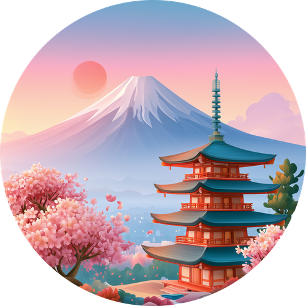
   </a>

<h1 align="center">
   Fuji
    
   (Premium)
</h1>

## Description

Inspired by Mount Fuji at first light, this light theme rests on the soft coral-peach glow of dawn over snow white, then lifts it with sakura pink and a lakeside torii's vermilion. The calm dawn surface keeps long sessions easy on the eyes while the blossom accents mark what matters.

## Screenshots

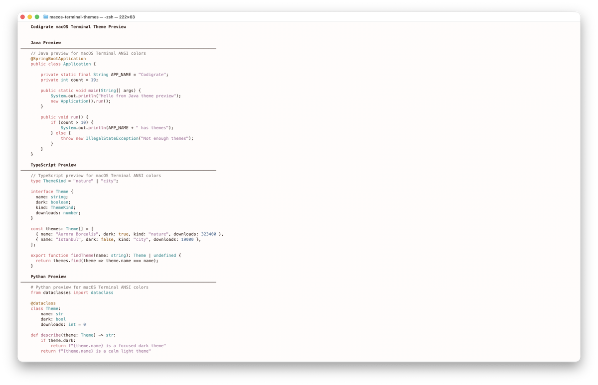

## Color Palette

<table>
   <tr>
      <td></td>
      <td>
         Snow White
      </td>
      <td>
         Background
      </td>
      <td>
         <a href="https://codigrate.com/tools/color/FFFCFB">#FFFCFB</a>
      </td>
   </tr>
   <tr>
      <td></td>
      <td>
         Sepia Ink
      </td>
      <td>
         Foreground
      </td>
      <td>
         <a href="https://codigrate.com/tools/color/45302B">#45302B</a>
      </td>
   </tr>
   <tr>
      <td></td>
      <td>
         Dawn Peach
      </td>
      <td>
         Selection Background
      </td>
      <td>
         <a href="https://codigrate.com/tools/color/FAD1E4">#FAD1E4</a>
      </td>
   </tr>
   <tr>
      <td></td>
      <td>
         Blossom Pink
      </td>
      <td>
         Cursor
      </td>
      <td>
         <a href="https://codigrate.com/tools/color/D96AA0">#D96AA0</a>
      </td>
   </tr>
</table>

---

   <a href="https://codigrate.com/theme/content?product=spring&platform=macos%20terminal">
      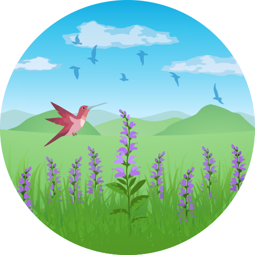
   </a>

<h1 align="center">
   Spring
    
   (Premium)
</h1>

## Description

Inspired by a spring garden in full bloom, from tulip beds and crocus to the first new grass under a clear sky, this theme pairs airy mint and soft green backgrounds with foxglove, violet, and cornflower accents to create a fresh and unhurried coding environment. Bright, open surfaces keep the editor calm, while clover greens, crocus violets, and robin egg blues add definition and focus to key syntax elements.

## Screenshots

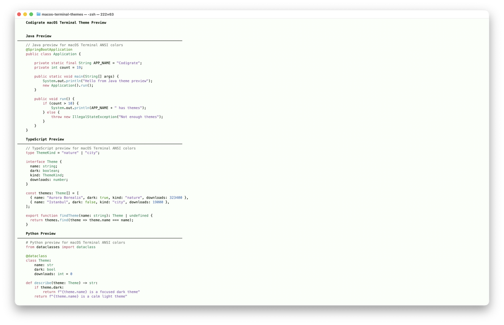

## Color Palette

<table>
   <tr>
      <td></td>
      <td>
         Daisy White
      </td>
      <td>
         Background
      </td>
      <td>
         <a href="https://codigrate.com/tools/color/FAFFF9">#FAFFF9</a>
      </td>
   </tr>
   <tr>
      <td></td>
      <td>
         Dark Moss
      </td>
      <td>
         Foreground
      </td>
      <td>
         <a href="https://codigrate.com/tools/color/142010">#142010</a>
      </td>
   </tr>
   <tr>
      <td></td>
      <td>
         Mint Air
      </td>
      <td>
         Selection Background
      </td>
      <td>
         <a href="https://codigrate.com/tools/color/F4E1E7">#F4E1E7</a>
      </td>
   </tr>
   <tr>
      <td></td>
      <td>
         Clover Green
      </td>
      <td>
         Cursor
      </td>
      <td>
         <a href="https://codigrate.com/tools/color/62954B">#62954B</a>
      </td>
   </tr>
</table>

## Cities

   

<h1 align="center">
   Istanbul
</h1>

## Description

Inspired by the soft daylight and sea breezes of Istanbul, this theme blends calm turquoise tones with warm historical accents to create a serene yet expressive coding environment. Light, airy backgrounds keep the editor clean and comfortable, while teals, aquas, and muted golden hues add clarity and focus to essential syntax elements.

## Screenshots

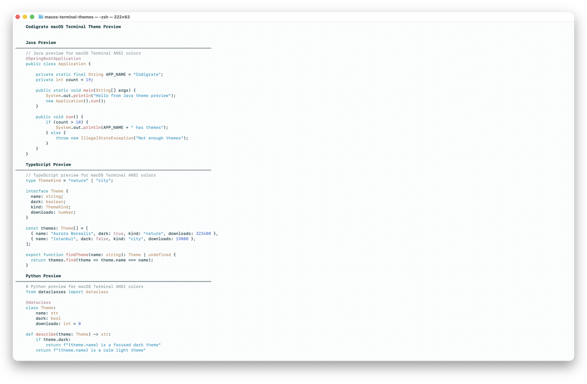

## Color Palette

<table>
   <tr>
      <td></td>
      <td>
         Marble White
      </td>
      <td>
         Background
      </td>
      <td>
         <a href="https://codigrate.com/tools/color/FAFDFD">#FAFDFD</a>
      </td>
   </tr>
   <tr>
      <td></td>
      <td>
         Midnight Strait
      </td>
      <td>
         Foreground
      </td>
      <td>
         <a href="https://codigrate.com/tools/color/05272C">#05272C</a>
      </td>
   </tr>
   <tr>
      <td></td>
      <td>
         Sea Glass
      </td>
      <td>
         Selection Background
      </td>
      <td>
         <a href="https://codigrate.com/tools/color/BADFDE">#BADFDE</a>
      </td>
   </tr>
   <tr>
      <td></td>
      <td>
         Ferry Blue
      </td>
      <td>
         Cursor
      </td>
      <td>
         <a href="https://codigrate.com/tools/color/42858E">#42858E</a>
      </td>
   </tr>
</table>

---

   <a href="https://codigrate.com/theme?product=miami&category=cities">
      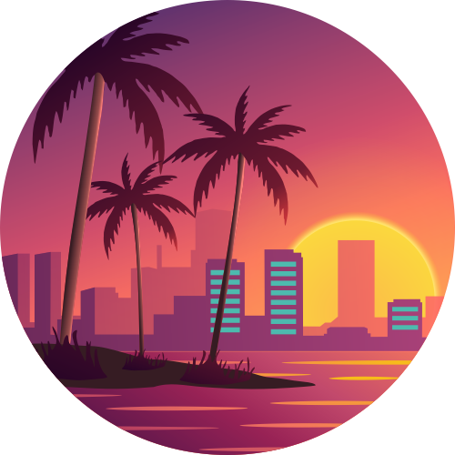
   </a>

<h1 align="center">
   Miami
</h1>

## Description

Inspired by the electric nights and pastel sunsets of Miami, this theme blends deep purples with vibrant neon accents to create a bold yet balanced coding environment. Dark, warm backgrounds ground the editor, while vivid pinks, corals, and tropical teals bring energy and clarity to key syntax elements.

## Screenshots

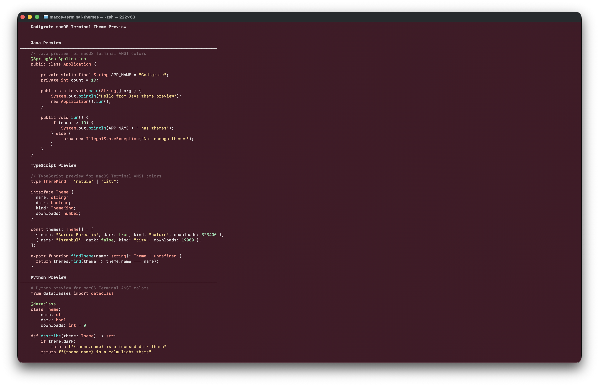

## Color Palette

<table>
   <tr>
      <td></td>
      <td>
         Midnight Vice
      </td>
      <td>
         Background
      </td>
      <td>
         <a href="https://codigrate.com/tools/color/33121D">#33121D</a>
      </td>
   </tr>
   <tr>
      <td></td>
      <td>
         Pearl Pink
      </td>
      <td>
         Foreground
      </td>
      <td>
         <a href="https://codigrate.com/tools/color/D8D3D4">#D8D3D4</a>
      </td>
   </tr>
   <tr>
      <td></td>
      <td>
         Berry Crush
      </td>
      <td>
         Selection Background
      </td>
      <td>
         <a href="https://codigrate.com/tools/color/5D224D">#5D224D</a>
      </td>
   </tr>
   <tr>
      <td></td>
      <td>
         Dusty Orchid
      </td>
      <td>
         Cursor
      </td>
      <td>
         <a href="https://codigrate.com/tools/color/E17CBF">#E17CBF</a>
      </td>
   </tr>
</table>

---

   

<h1 align="center">
   Rio de Janeiro
</h1>

## Description

Inspired by Rio's lush hills, soft morning light, and ocean air, this theme blends airy minty backgrounds with confident rainforest greens and clean coastal blues. The editor stays bright and calm for long sessions, while crisp greens and balanced accents keep syntax readable and focused.

## Screenshots

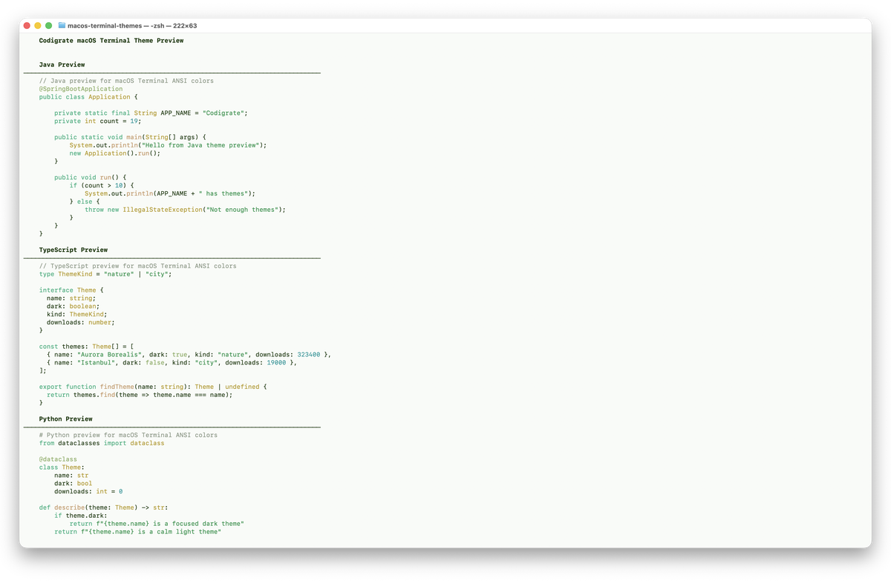

## Color Palette

<table>
   <tr>
      <td></td>
      <td>
         Morning Breeze
      </td>
      <td>
         Background
      </td>
      <td>
         <a href="https://codigrate.com/tools/color/F7FAF6">#F7FAF6</a>
      </td>
   </tr>
   <tr>
      <td></td>
      <td>
         Forest Ink
      </td>
      <td>
         Foreground
      </td>
      <td>
         <a href="https://codigrate.com/tools/color/0D2704">#0D2704</a>
      </td>
   </tr>
   <tr>
      <td></td>
      <td>
         Palm Shade
      </td>
      <td>
         Selection Background
      </td>
      <td>
         <a href="https://codigrate.com/tools/color/CADFC2">#CADFC2</a>
      </td>
   </tr>
   <tr>
      <td></td>
      <td>
         Vivid Leaf
      </td>
      <td>
         Cursor
      </td>
      <td>
         <a href="https://codigrate.com/tools/color/4A873F">#4A873F</a>
      </td>
   </tr>
</table>

---

   <a href="https://codigrate.com/theme?product=paris&category=cities">
      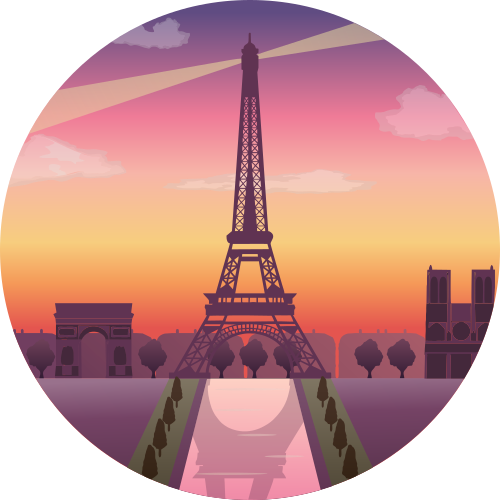
   </a>

<h1 align="center">
   Paris
</h1>

## Description

Inspired by elegant boulevards and Paris's sunset glow, this theme trades bright champagne for dusty rose accents over calm plum-espresso tones. Soft dark editor backgrounds keep focus clear, while mauve surfaces and wine-tinted hovers add depth and balance, with a gentle blush accent guiding attention across the interface.

## Screenshots

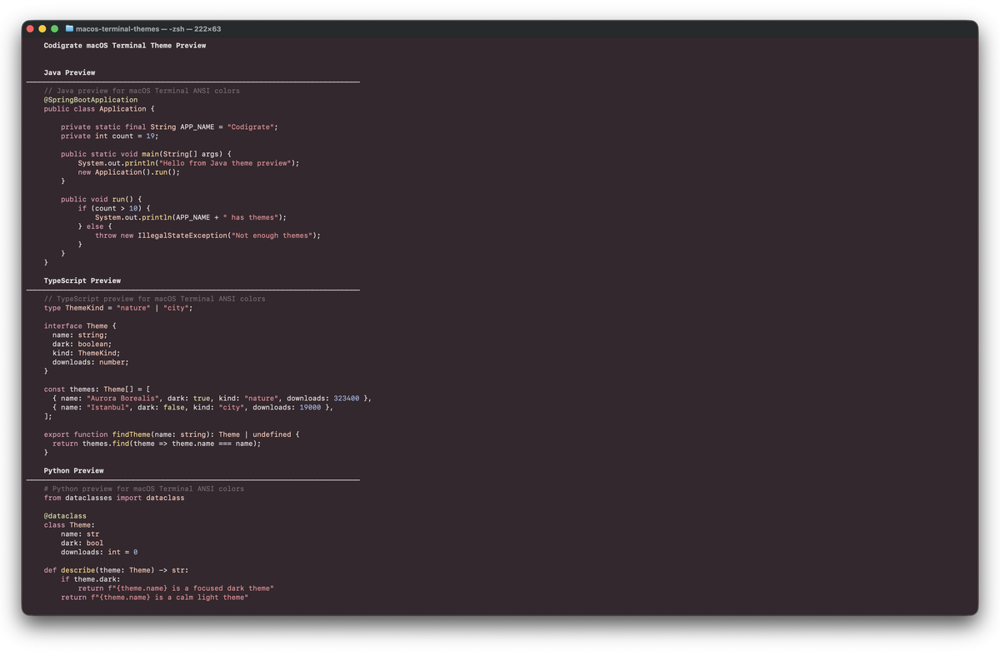

## Color Palette

<table>
   <tr>
      <td></td>
      <td>
         Parisian Night
      </td>
      <td>
         Background
      </td>
      <td>
         <a href="https://codigrate.com/tools/color/281D22">#281D22</a>
      </td>
   </tr>
   <tr>
      <td></td>
      <td>
         Ivory Lace
      </td>
      <td>
         Foreground
      </td>
      <td>
         <a href="https://codigrate.com/tools/color/DBD7D7">#DBD7D7</a>
      </td>
   </tr>
   <tr>
      <td></td>
      <td>
         Wine Cellar
      </td>
      <td>
         Selection Background
      </td>
      <td>
         <a href="https://codigrate.com/tools/color/722832">#722832</a>
      </td>
   </tr>
   <tr>
      <td></td>
      <td>
         Montmartre Rose
      </td>
      <td>
         Cursor
      </td>
      <td>
         <a href="https://codigrate.com/tools/color/C38AA4">#C38AA4</a>
      </td>
   </tr>
</table>

---

   <a href="https://codigrate.com/theme?product=tallinn&category=cities">
      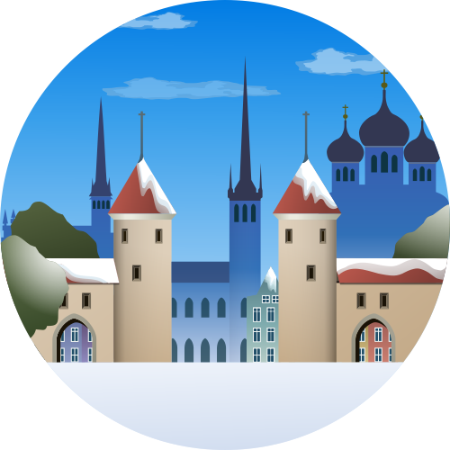
   </a>

<h1 align="center">
   Tallinn
</h1>

## Description

Inspired by Tallinn's crisp light and Baltic calm, this theme pairs airy porcelain backgrounds with cool Nordic blues for a clean, focused coding experience. Soft, bright surfaces enhance readability, while deep ink accents and subtle lavender-rose highlights add clarity and warmth without losing the chill vibe.

## Screenshots

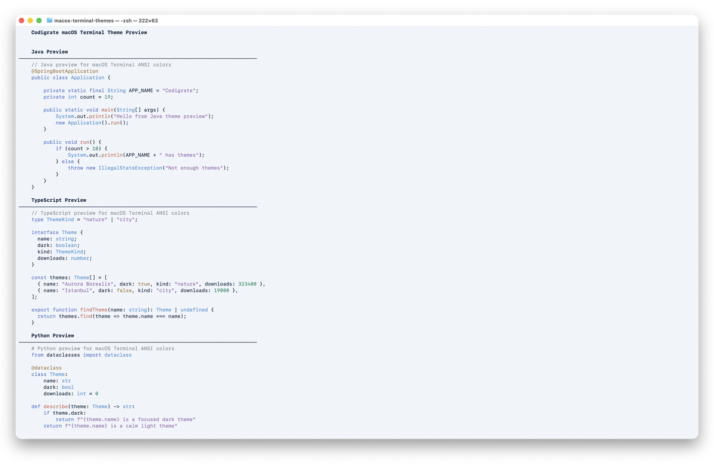

## Color Palette

<table>
   <tr>
      <td></td>
      <td>
         Baltic Morning
      </td>
      <td>
         Background
      </td>
      <td>
         <a href="https://codigrate.com/tools/color/EDF2FA">#EDF2FA</a>
      </td>
   </tr>
   <tr>
      <td></td>
      <td>
         Midnight Baltic
      </td>
      <td>
         Foreground
      </td>
      <td>
         <a href="https://codigrate.com/tools/color/0C172B">#0C172B</a>
      </td>
   </tr>
   <tr>
      <td></td>
      <td>
         Limestone Blue
      </td>
      <td>
         Selection Background
      </td>
      <td>
         <a href="https://codigrate.com/tools/color/B7C3E3">#B7C3E3</a>
      </td>
   </tr>
   <tr>
      <td></td>
      <td>
         Cobalt Spire
      </td>
      <td>
         Cursor
      </td>
      <td>
         <a href="https://codigrate.com/tools/color/4D6FA2">#4D6FA2</a>
      </td>
   </tr>
</table>

---

   <a href="https://codigrate.com/theme?product=tokyo&category=cities">
      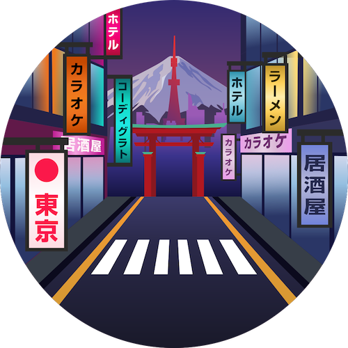
   </a>

<h1 align="center">
   Tokyo
</h1>

## Description

Inspired by Tokyo's neon-lit side streets, midnight skylines, and the quiet glow of lantern-lined alleys, this theme blends deep indigo shadows with electric violet highlights to create a sleek, futuristic coding atmosphere. Moody blues keep the editor calm and focused, while luminous purples, soft lilacs, and crisp cyan accents add clarity and energy to key syntax elements.

## Screenshots

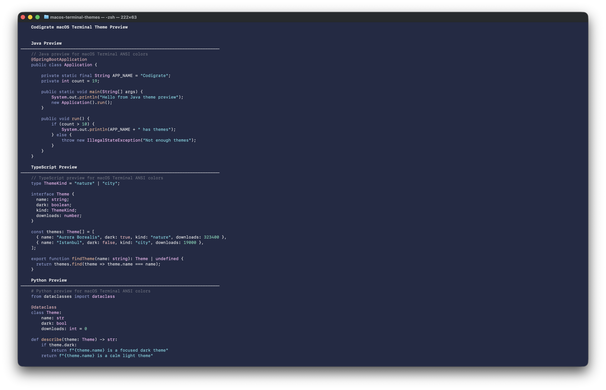

## Color Palette

<table>
   <tr>
      <td></td>
      <td>
         Tokyo Midnight
      </td>
      <td>
         Background
      </td>
      <td>
         <a href="https://codigrate.com/tools/color/1A1F35">#1A1F35</a>
      </td>
   </tr>
   <tr>
      <td></td>
      <td>
         Streetlight Silver
      </td>
      <td>
         Foreground
      </td>
      <td>
         <a href="https://codigrate.com/tools/color/D6D6DA">#D6D6DA</a>
      </td>
   </tr>
   <tr>
      <td></td>
      <td>
         Purple Alley
      </td>
      <td>
         Selection Background
      </td>
      <td>
         <a href="https://codigrate.com/tools/color/5E3061">#5E3061</a>
      </td>
   </tr>
   <tr>
      <td></td>
      <td>
         Skyline Blue
      </td>
      <td>
         Cursor
      </td>
      <td>
         <a href="https://codigrate.com/tools/color/939ED3">#939ED3</a>
      </td>
   </tr>
</table>

---

   <a href="https://codigrate.com/theme/content?product=sydney&platform=macos%20terminal">
      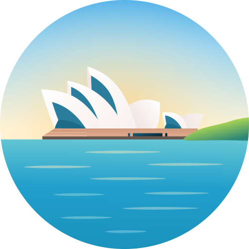
   </a>

<h1 align="center">
   Sydney
    
   (Premium)
</h1>

## Description

Inspired by Sydney Harbour at midday, from the white sails of the Opera House to the sandstone glowing along the shore, this theme pairs airy white and pale mist backgrounds with harbour blues, jade teals, and outback golds to create a bright and vibrant coding environment. Light, open surfaces keep the editor clear, while Pacific blues, warm coppers, and desert clays add definition and focus to key syntax elements.

## Screenshots

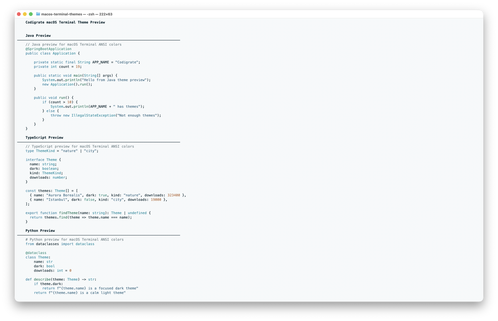

## Color Palette

<table>
   <tr>
      <td></td>
      <td>
         Opera White
      </td>
      <td>
         Background
      </td>
      <td>
         <a href="https://codigrate.com/tools/color/F6F9FA">#F6F9FA</a>
      </td>
   </tr>
   <tr>
      <td></td>
      <td>
         Ocean Ink
      </td>
      <td>
         Foreground
      </td>
      <td>
         <a href="https://codigrate.com/tools/color/05242E">#05242E</a>
      </td>
   </tr>
   <tr>
      <td></td>
      <td>
         Peach Shell
      </td>
      <td>
         Selection Background
      </td>
      <td>
         <a href="https://codigrate.com/tools/color/ECE7D1">#ECE7D1</a>
      </td>
   </tr>
   <tr>
      <td></td>
      <td>
         Jade Bay
      </td>
      <td>
         Cursor
      </td>
      <td>
         <a href="https://codigrate.com/tools/color/42798E">#42798E</a>
      </td>
   </tr>
</table>

---

   <a href="https://codigrate.com/theme/content?product=prague&platform=macos%20terminal">
      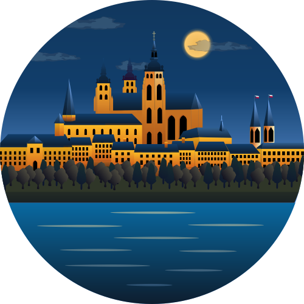
   </a>

<h1 align="center">
   Prague
    
   (Premium)
</h1>

## Description

Inspired by Prague after dark, from the deep blues of the Vltava to the gas lamps glowing along its bridges, this theme layers midnight navy and castle blue shadows with amber, copper, and straw gold accents to create a warm and cinematic coding environment. Deep, cool backgrounds keep the editor restful, while pale river blues, lantern ambers, and rooftop coppers add clarity and focus to key syntax elements.

## Screenshots

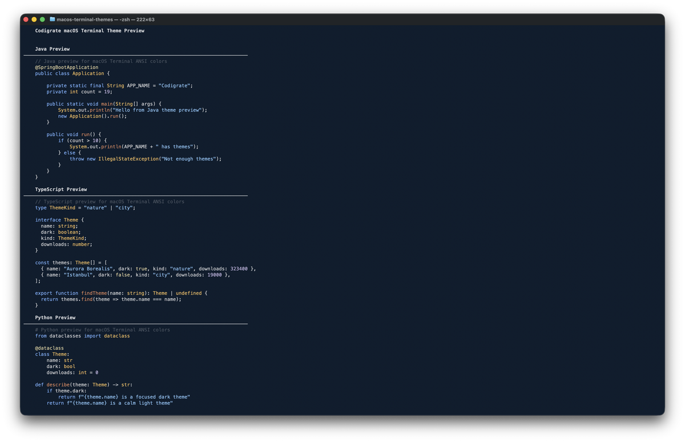

## Color Palette

<table>
   <tr>
      <td></td>
      <td>
         Vltava Night
      </td>
      <td>
         Background
      </td>
      <td>
         <a href="https://codigrate.com/tools/color/0D1D2E">#0D1D2E</a>
      </td>
   </tr>
   <tr>
      <td></td>
      <td>
         Moonstone
      </td>
      <td>
         Foreground
      </td>
      <td>
         <a href="https://codigrate.com/tools/color/CED0D3">#CED0D3</a>
      </td>
   </tr>
   <tr>
      <td></td>
      <td>
         Brass Shadow
      </td>
      <td>
         Selection Background
      </td>
      <td>
         <a href="https://codigrate.com/tools/color/544410">#544410</a>
      </td>
   </tr>
   <tr>
      <td></td>
      <td>
         Stone Blue
      </td>
      <td>
         Cursor
      </td>
      <td>
         <a href="https://codigrate.com/tools/color/90B2D1">#90B2D1</a>
      </td>
   </tr>
</table>

---

   

<h1 align="center">
   Vienna
    
   (Premium)
</h1>

## Description

Inspired by a Viennese evening at the opera, from velvet seats and candlelit boxes to gilded balconies and the sheet music on the stands, this theme layers mahogany and crimson shadows with imperial gold, candlelight, and marzipan accents to create a warm and cinematic coding environment. Deep, rich backgrounds keep the editor restful, while golds, pastry creams, and palace olives add clarity and focus to key syntax elements.

## Screenshots

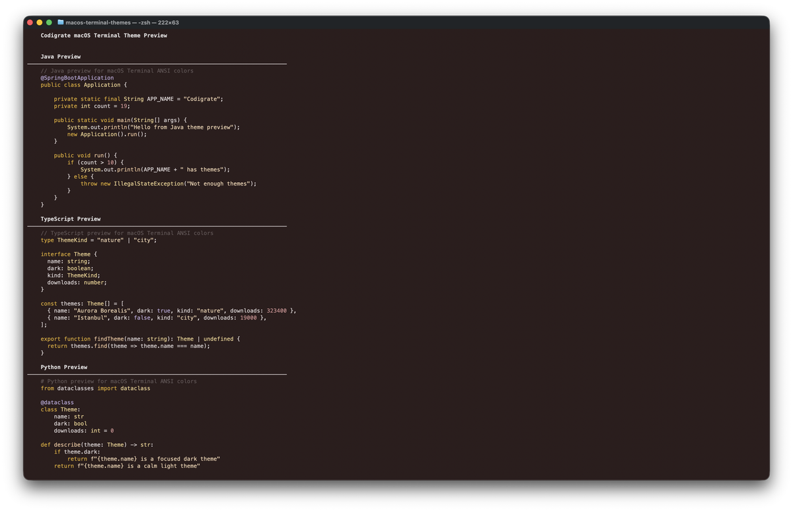

## Color Palette

<table>
   <tr>
      <td></td>
      <td>
         Mahogany Night
      </td>
      <td>
         Background
      </td>
      <td>
         <a href="https://codigrate.com/tools/color/2C1D1D">#2C1D1D</a>
      </td>
   </tr>
   <tr>
      <td></td>
      <td>
         Porcelain
      </td>
      <td>
         Foreground
      </td>
      <td>
         <a href="https://codigrate.com/tools/color/DDD5D5">#DDD5D5</a>
      </td>
   </tr>
   <tr>
      <td></td>
      <td>
         Muted Plum
      </td>
      <td>
         Selection Background
      </td>
      <td>
         <a href="https://codigrate.com/tools/color/615532">#615532</a>
      </td>
   </tr>
   <tr>
      <td></td>
      <td>
         Gilded Frame
      </td>
      <td>
         Cursor
      </td>
      <td>
         <a href="https://codigrate.com/tools/color/BC8488">#BC8488</a>
      </td>
   </tr>
</table>

---

   

<h1 align="center">
   Madrid
    
   (Premium)
</h1>

## Description

Inspired by a Madrid balcony at midday, from sunlit facades and saffron awnings to the claveles spilling over the railings, this theme pairs warm golden and cream backgrounds with flamenco reds, sangria, and azulejo blues to create a bright and vibrant coding environment. Light, sun-warmed surfaces keep the editor clear, while Toledo golds, Spanish reds, and Andalusian teals add definition and focus to key syntax elements.

## Screenshots

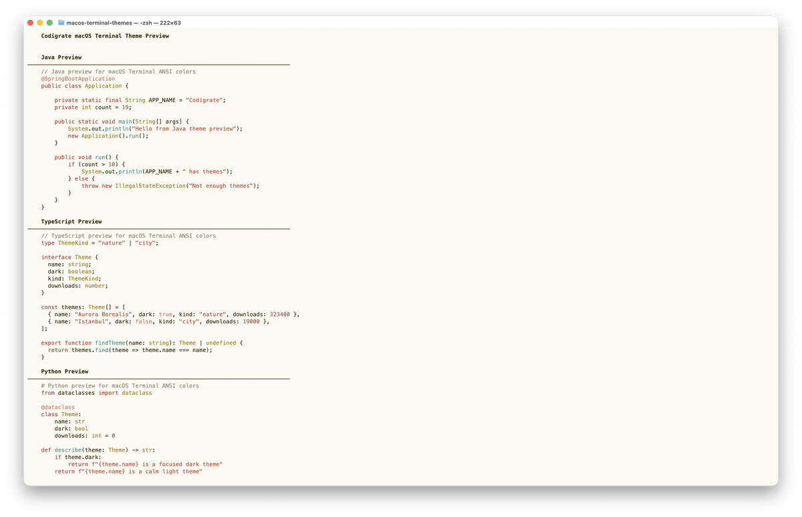

## Color Palette

<table>
   <tr>
      <td></td>
      <td>
         Linen White
      </td>
      <td>
         Background
      </td>
      <td>
         <a href="https://codigrate.com/tools/color/FBFAF2">#FBFAF2</a>
      </td>
   </tr>
   <tr>
      <td></td>
      <td>
         Dark Umber
      </td>
      <td>
         Foreground
      </td>
      <td>
         <a href="https://codigrate.com/tools/color/372805">#372805</a>
      </td>
   </tr>
   <tr>
      <td></td>
      <td>
         Sunlit Facade
      </td>
      <td>
         Selection Background
      </td>
      <td>
         <a href="https://codigrate.com/tools/color/F8D0A3">#F8D0A3</a>
      </td>
   </tr>
   <tr>
      <td></td>
      <td>
         Toledo Gold
      </td>
      <td>
         Cursor
      </td>
      <td>
         <a href="https://codigrate.com/tools/color/B38713">#B38713</a>
      </td>
   </tr>
</table>

---

   <a href="https://codigrate.com/theme/content?product=london&platform=macos%20terminal">
      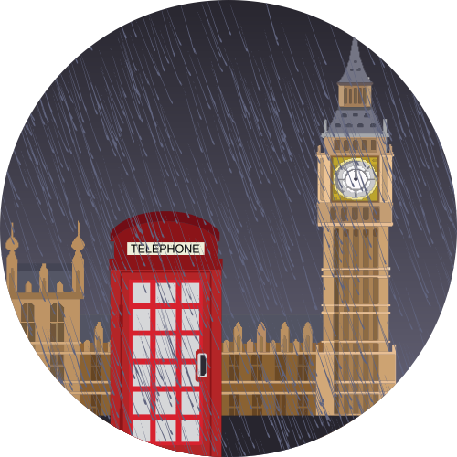
   </a>

<h1 align="center">
   London
    
   (Premium)
</h1>

## Description

Inspired by London at dusk, this dark theme rests on a slate grey base washed with twilight indigo, then lights it with the pillar box red of a K6 telephone box and the muted steel blue of the Thames. The calm grey surface keeps long sessions easy on the eyes while the red accents mark what matters.

## Screenshots

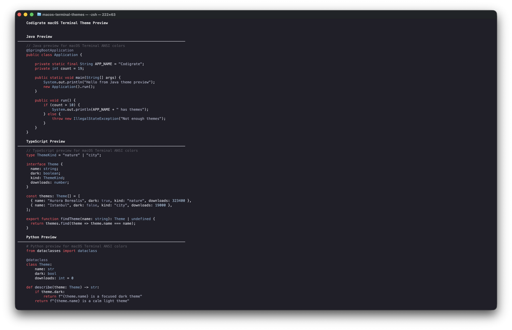

## Color Palette

<table>
   <tr>
      <td></td>
      <td>
         Dusk Slate
      </td>
      <td>
         Background
      </td>
      <td>
         <a href="https://codigrate.com/tools/color/201F29">#201F29</a>
      </td>
   </tr>
   <tr>
      <td></td>
      <td>
         Portland Stone
      </td>
      <td>
         Foreground
      </td>
      <td>
         <a href="https://codigrate.com/tools/color/D4D5DE">#D4D5DE</a>
      </td>
   </tr>
   <tr>
      <td></td>
      <td>
         Brick Shadow
      </td>
      <td>
         Selection Background
      </td>
      <td>
         <a href="https://codigrate.com/tools/color/4E2F39">#4E2F39</a>
      </td>
   </tr>
   <tr>
      <td></td>
      <td>
         Brick Rose
      </td>
      <td>
         Cursor
      </td>
      <td>
         <a href="https://codigrate.com/tools/color/E08A95">#E08A95</a>
      </td>
   </tr>
</table>

---

   

<h1 align="center">
   Dublin
    
   (Premium)
</h1>

## Description

Inspired by Dublin on a bright morning, this light theme rests on a fresh park green base, then lights it with shamrock green and the orange of the autumn trees around the castle tower. The soft green surface keeps long sessions easy on the eyes while the green and orange accents mark what matters.

## Screenshots

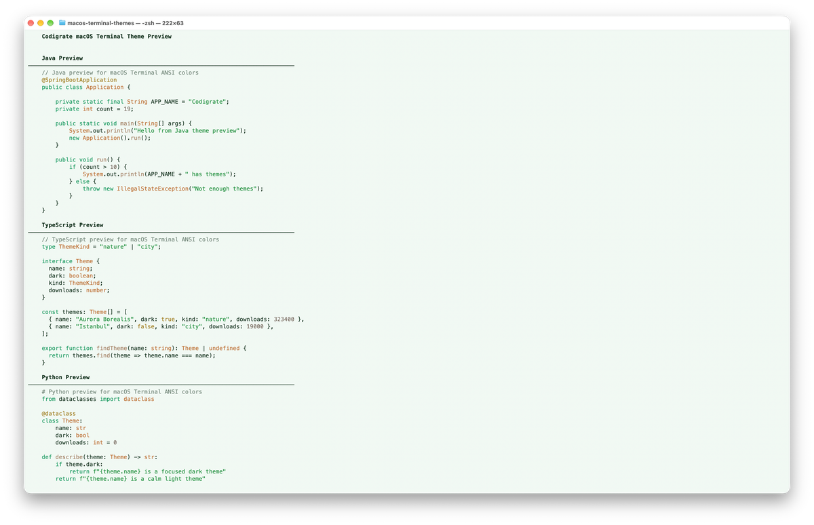

## Color Palette

<table>
   <tr>
      <td></td>
      <td>
         Ha'penny White
      </td>
      <td>
         Background
      </td>
      <td>
         <a href="https://codigrate.com/tools/color/F1F9F4">#F1F9F4</a>
      </td>
   </tr>
   <tr>
      <td></td>
      <td>
         Black Pool
      </td>
      <td>
         Foreground
      </td>
      <td>
         <a href="https://codigrate.com/tools/color/0F2E1A">#0F2E1A</a>
      </td>
   </tr>
   <tr>
      <td></td>
      <td>
         Ha'penny White
      </td>
      <td>
         Selection Background
      </td>
      <td>
         <a href="https://codigrate.com/tools/color/FBE3C3">#FBE3C3</a>
      </td>
   </tr>
   <tr>
      <td></td>
      <td>
         Stephen's Green
      </td>
      <td>
         Cursor
      </td>
      <td>
         <a href="https://codigrate.com/tools/color/1B6B3A">#1B6B3A</a>
      </td>
   </tr>
</table>

<!-- codigrate-readme-footer -->

## Contributing

Issues and suggestions are welcome. Open an issue on this repository, or reach us at [info@codigrate.com](mailto:info@codigrate.com).

## Contributors

## License

The source code for this project is released under the [MIT License](LICENSE).

## Codigrate

Themes, color tools and developer experience products from [Codigrate](https://codigrate.com).

   <a href="https://codigrate.com/themes">All Themes</a> ·
   <a href="https://codigrate.com/tools">Color Tools</a> ·
   <a href="https://codigrate.com/plugins">Plugins</a> ·
   <a href="https://codigrate.com/blog">Blog</a> ·
   <a href="https://github.com/codigrate">GitHub</a>

<table align="right"><tr><td></td><td><b>Codigrate © 2026</b></td></tr></table>
